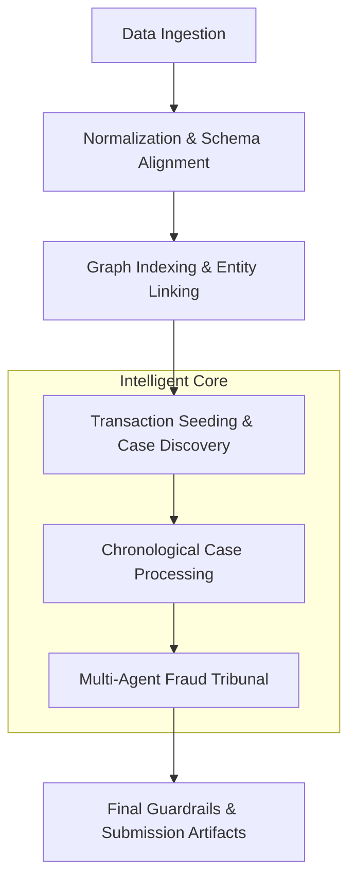

# 🕵️‍♂️ Trax Agent | Echo Fraud Agents


> **Autonomous Multimodal Fraud Investigation Pipeline**
> Engineered for the Reply Mirror Fraud Challenge. A bounded, intelligent system designed to ingest complex transaction bundles, construct cross-entity case files, and deliver high-precision fraud detection outputs.

---

## 🚀 Key Features

- **🧠 LLM-Led Discovery**: Guided by advanced models (Claude 3.5 Sonnet / GPT-4o) to identify non-obvious fraud patterns.
- **🔗 Entity Linking**: Deterministic graph indexing to connect disparate transactions into coherent cases.
- **🛡️ Fraud Tribunal**: A multi-agent consensus mechanism (Specialists & Supervisors) to minimize false positives.
- **📊 Rank & Score**: Automated ranking and scoring for high-confidence submission artifacts.
- **⚡ High Performance**: Optimized for speed with batched processing and shared fraud memory.

---

## 🏗️ Architecture

The pipeline operates in 7 distinct stages, from raw data ingestion to final guardrail checks.



---

## 🛠️ Environment Configuration

Create a `.env` file in the project root. Refer to `.env.example` for the required keys.

| Variable | Description |
| :--- | :--- |
| `OPENROUTER_API_KEY` | API Key for model access via OpenRouter. |
| `LANGFUSE_PUBLIC_KEY` | Langfuse public key for observability. |
| `LANGFUSE_SECRET_KEY` | Langfuse secret key for tracing. |
| `LANGFUSE_HOST` | Host URL for the Langfuse instance. |
| `TEAM_NAME` | Your team identifier for submission. |

---

## 📥 Installation

Ensure you have Python 3.10+ installed.

```powershell
# Initialize Virtual Environment
python -m venv .venv
.\.venv\Scripts\Activate.ps1

# Install Dependencies
pip install -r requirements.txt
```

---

## 🏃 Usage

### Standard Run
Execute the pipeline on a dataset bundle zip file:

```powershell
python main.py --input "path/to/dataset.zip" --output-root "./runs"
```

### With Dataset Filtering
If the archive contains multiple nested bundles:

```powershell
python main.py --input "path/to/multiple_datasets.zip" --dataset-filter "target-dataset-name" --output-root "./runs"
```

---

## 📤 Output Artifacts

Each run generates a structured directory containing:

| File | Purpose |
| :--- | :--- |
| `submission.txt` | Formatted output for competition submission. |
| `run_summary.json` | High-level metrics and result overview. |
| `ranked_transactions.csv` | Full list of transactions sorted by fraud probability. |
| `case_reviews.json` | Detailed LLM reasoning for every flagged case. |
| `diagnostics.json` | System performance and token usage logs. |

---

## 👨‍💻 Author

**Dibyajyoti**  
[sdibyajyoti999@gmail.com](mailto:sdibyajyoti999@gmail.com)

---
*Developed for the Reply Mirror Fraud Challenge.*
